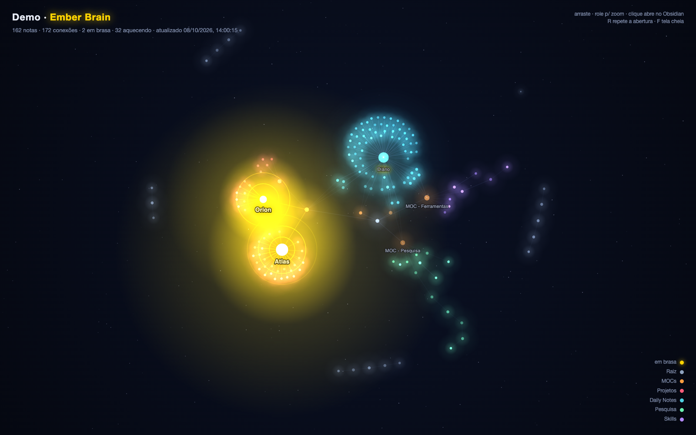

# Ember Brain

Watch your vault come alive. Ember Brain opens your notes as an **animated graph** in its own tab, next to the core Graph view: your most active notes glow and pulse, light flows along your links, and the whole vault grows in the order you wrote it.



## Features

- **Intro.** Notes appear in creation order while a date ticks in the corner. Replay it anytime.
- **Notes on fire.** Hot notes pulse in gold with sonar rings.
- **Light along links.** Particles flow towards the hottest notes.
- **Breathing graph.** Warm notes breathe slowly; cold ones twinkle faintly.
- **Folder colors.** Each folder gets its own color over a starry sky. Colors are configurable.
- **Heat from your edits.** Notes that you edit often, and the notes linked to them, get hotter. Optionally, the heat is written to each note's `heat` property, so the core Graph view can use it too.
- **Live.** The graph updates as you create, edit, rename or delete notes.
- **Click to open.** Click a note to open it in a new tab, or `Cmd/Ctrl`+click to open it to the side.
- **Languages.** The interface is in English and Portuguese, following Obsidian's language.

## How heat is decided

Ember Brain keeps a history of your edits and scores each note by how often it was edited recently:

- **Each editing session counts once.** Saves less than an hour apart are one update.
- **Recent edits weigh more.** Each update counts `e^(-days/7)`, so its weight halves about every 5 days. Updates older than 60 days are dropped.
- **Hubs warm up.** A note also gets a quarter of the score of every note linked to it, in either direction. A project page heats up when its notes are edited.
- **Thresholds.** A score of 2 or more is hot, 0.5 or more is warm, and anything lower is cold.

The history starts when you install the plugin: on the first run, each note counts its last edit as one update, and the graph gets more accurate over the following days. It is saved in the plugin's `data.json`, inside your vault.

**A `heat` property wins.** If a note has `heat: hot`, `heat: warm` or `heat: cold` in its frontmatter, that value is used instead. You can set it by hand, or turn this off in the settings.

## Usage

Click the **flame** icon in the ribbon, or run **Ember Brain: Open animated graph** from the command palette.

| Action | Result |
|---|---|
| Drag / scroll | Pan / zoom (turns off the automatic camera) |
| Hover a note | Name, path, number of links and heat |
| Click a note | Open it in a new tab (`Cmd/Ctrl`+click: to the side) |
| `R` or ↺ | Replay the intro |
| ⤢ | Fullscreen |

## Settings

| Setting | Description |
|---|---|
| Root folder | Only notes in this folder are shown, colored by their subfolder. Leave empty for the whole vault. |
| Folder colors | One per line, as `Folder: #rrggbb`. Folders without a color get one from the palette. |
| Intro duration | Seconds for all notes to appear. |
| Use the heat property | Notes with a `heat` property use it instead of the edit history. On by default. |
| Write the heat property | Every hour, writes the heat from the edit history to each note's `heat` property, keeping the note's modification date. Use it to color the core Graph view (see below). Off by default. |

### Coloring the core Graph view

Turn on **Write the heat property**, then in *Graph view → Groups* add the searches `[heat:hot]`, `[heat:warm]` and `[heat:cold]` with the colors you like. The first matching group sets a note's color, so put `[heat:hot]` on top.

## Installation

- **From Community plugins:** in *Settings → Community plugins → Browse*, search for **Ember Brain**, or open its [page in the plugin directory](https://community.obsidian.md/plugins/ember-brain).
- **Manually:** download `main.js`, `manifest.json` and `styles.css` from the [latest release](https://github.com/edersonmelo/obsidian-ember-brain/releases/latest) into `<vault>/.obsidian/plugins/ember-brain/`. Then enable the plugin in *Settings → Community plugins*.

## Companion script: Notion in your graph

[obsidian-heatmap](https://github.com/edersonmelo/obsidian-heatmap) is a Python script, outside Obsidian, that came before this plugin. Its main use now is mirroring the structure of your Notion workspace into the vault as light notes, so Notion pages show up in the graph and heat up when edited in Notion. It also computes heat and can write the `heat` property. If you use both, only one of them should write it: see that project's README.

## Privacy

Ember Brain works entirely offline:
- It makes no network requests.
- It collects no data.
- It never modifies your notes, unless you turn on **Write the heat property**. Then it only adds or updates the `heat` line in each note's frontmatter. Otherwise it only reads links, frontmatter and file dates.
- The edit history is a list of dates per note path, saved in the plugin's `data.json` inside your vault.
- To draw the graph, it lists the Markdown notes in your vault (or only those in the root folder, if you set one). The list stays in memory and never leaves your device.

## Development

```sh
npm install
npm run dev    # rebuild on change
npm run lint   # eslint with eslint-plugin-obsidianmd (the same rules as the plugin review)
npm run build  # type-check and produce main.js
```

To release, run `npm version patch` (or `minor`/`major`), then push the commit and the tag: `git push origin main <version>`. The tag is lightweight and has no "v", as the plugin directory expects, so `git push --follow-tags` does not push it. The GitHub Action builds the plugin, attests `main.js` and `styles.css`, and publishes the release with `main.js`, `manifest.json` and `styles.css`.

The graph is drawn on a 2D canvas. The physics uses [d3-force](https://github.com/d3/d3-force), bundled into `main.js`.

## License

[MIT](LICENSE) © Ederson Melo
